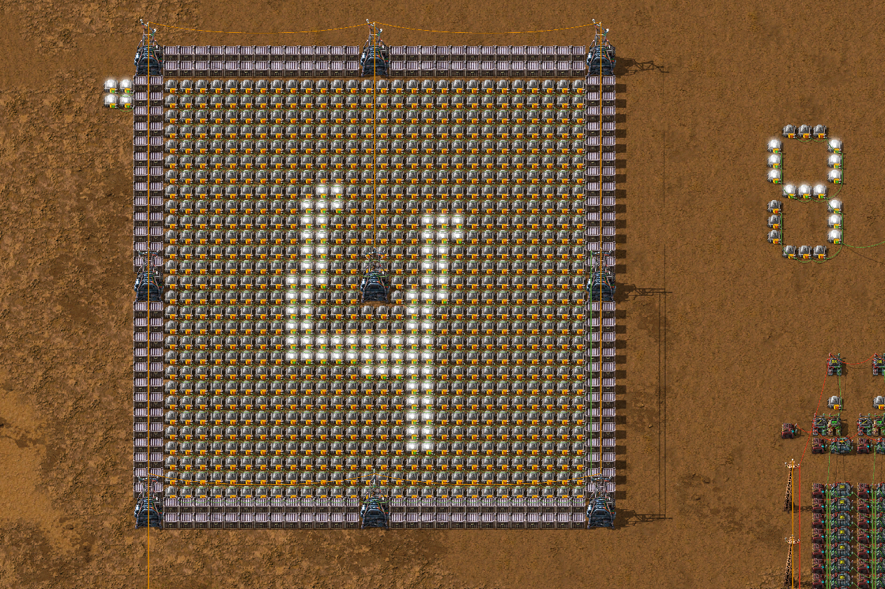
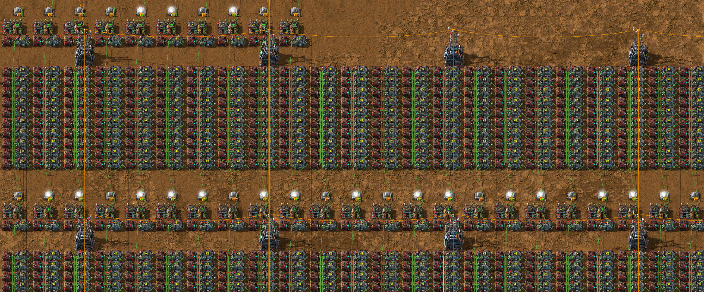

# MNIST Classification in Factorio

   

It began with an interesting design in Factorio.

But first, let me introduce the game. Factorio is a construction and management simulation video game in which you build and maintain factories. It's one of those games where required resources and the advancement of production methods grow exponentially, so there's almost infinite amount of work to do at all stages of the game. To keep the factory running without major dips in production is challenging. Among its various mechanics it allows to build advanced circut networks to control your factory (before you ask, of course someone has re-created [Doom](https://www.youtube.com/watch?v=0bAuP0gO5pc) in it). 

Funnily enough, if you happen to be a programmer of any kind and spend some time with the game you would conclude that there is no difference between coding and playing Factorio. The system design patterns, various ideas about distributing resources, the scaling of a system, observing unexpected behaviour along with increasing complexity - you name it. Discovering so many parallels across a wide range of abstraction levels is extremely satisfying. More about it [here](https://www.reddit.com/r/factorio/comments/rspj58/why_so_many_programmers/). It's a brilliant game and I cannot recommend it enough.

Back to the project. After classifying handwritten digits form the MNIST dataset, which is the standard introduction to machine learning (with [this](https://www.youtube.com/playlist?list=PLQVvvaa0QuDfhTox0AjmQ6tvTgMBZBEXN) series, by the way) there are few things that can help you understand the subject better than playing with the model and building things from scratch. To be able to do both of those simultaneously in one of your favourite games left me with no excuses not to do this. I decided to build a neural net with two dense layers, 32 neurons each. If you're familiar with the basics of electronics, the net itself is quite simple to design. 

   

I'm happy with the mentioned input 28x28 'whiteboard' - you can draw numbers with your mouse directly, which is crucial for the whole project; after having come up with this design everything clicked in my head. It uses a clever solution of manipulating the memory cells with blueprints; I will spare you the details.  A bit of an issue was that the cirut network operates only on signed 32-bit integers, so to keep the precision within reasonable range and avoid overflow it was necessary to scale down the outputs of each dense layer. In order to load the parameters into the game's memory cells I wrote a simple script in Lua.

After initial experiments I concluded that the net does not perform well on some kinds of inputs - e.g. the ones that do not fill the majority of the input whiteboard or those who lean more to the side. For me it was clear that it is necessary to add such examples to the training set - that way I sort-of discovered data augmentation on my own. 

   

With some trail and error I managed to uplift the performance of a net. Now I'm glad with the results.